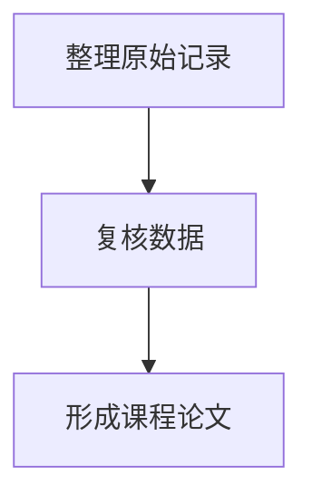
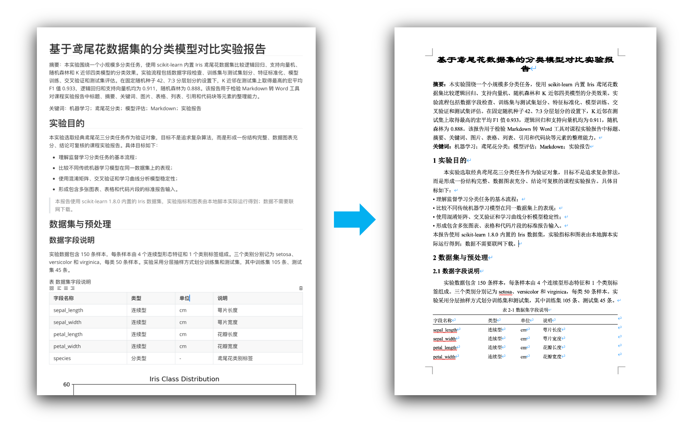
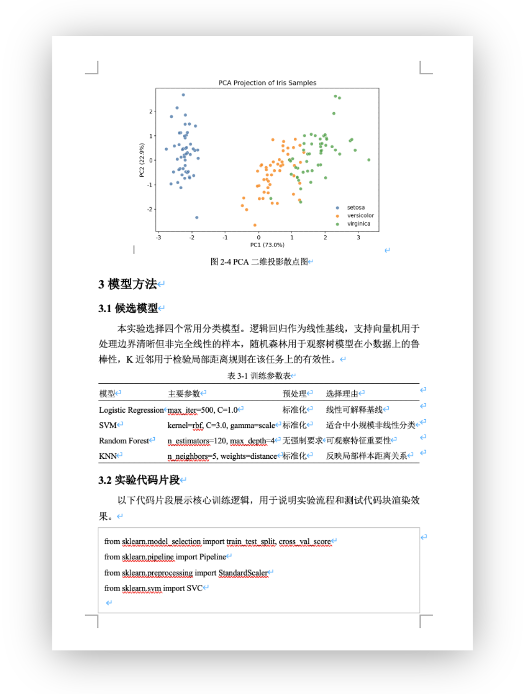
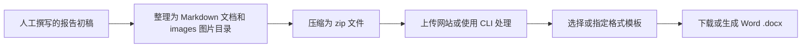

# CAU Markdown 论文格式整理工具

一个 Markdown 到 DOCX 整理工具，面向中国农业大学课程论文等校内论文格式场景。当前版本提供网页应用、命令行脚本和单 HTML 离线网页版；网页中的解析、图片读取和 Word 生成都在浏览器本地完成，不依赖服务端。

## 交给 Agent 的命令行处理提示词

将人工撰写的报告初稿和原始图片材料提供给能够读写文件、执行命令的 Agent 后，可直接使用下面的提示词让其整理并生成 Word 文档：

````text
请将我提供的报告初稿与图片材料整理为 Word 文档。以原稿内容、数据和结论为准，不要擅自扩写实验结果或改变观点。

请整理一份可被“论文格式自动整理”工具稳定处理的 Markdown 文档，并按以下规则组织内容：

1. 输出一个完整的 Markdown 文档，不要输出解释性文字。
2. 文档将与 images/ 目录一起打包为 zip；所有图片必须使用相对路径，例如：。
3. 一级 Markdown 标题 # 用作论文标题；##、###、#### 分别作为正文中的一级、二级、三级标题。
4. 不要手写标题编号，转换工具会自动编号。
5. 摘要可以写成“摘要：摘要正文”，也可以把“摘要”单独写一行后下一段写摘要正文；不要写成 Markdown 标题。
6. 关键词单独写一段，格式为“关键词：词一；词二；词三”。
7. 表格必须使用 GFM Markdown 表格语法。
8. 每个表格的表题必须单独放在表格正上方一行，格式为“表 1 表题文字”或“表1 表题文字”；表题行和表格之间不要插入其他内容。
9. 如果工具开启表题自动编号，表题行也可以写成“表 表题文字”，工具会自动整理为“表1-1”或“表1”。
10. 图片必须单独成段，不要和正文放在同一行。
11. 每张图片的图题必须单独放在图片正下方一行，格式为“图 图题文字”或“图1 图题文字”；图题行和图片之间不要插入其他内容。
12. 如果工具开启图题自动编号，图题会自动整理为“图1-1”或“图1”，不要在图题正文里重复编号。
13. 表格内容只写数据，不要在表格内部写表题；单元格内的竖线必须写作 `\|`，例如 `RDR1\|PING\|7\n`。
14. 正文段落保持自然中文论文表达，避免使用 HTML。
15. 普通代码使用 fenced code block；需要流程图、状态图、类图或时序图时，使用语言标记为 `mermaid` 的 fenced code block，并在其正下方写图题。不要把 Mermaid 预先截图为图片。
16. Mermaid 图表会按所选模板的图型开关转换为 PNG，并采用模板设置的论文黑白风格；未启用或渲染失败时会保留为代码块。
17. 默认使用“CAU 课程论文（含目录页码）”模板，并添加默认 CAU 课程论文封面。网页端请选择该模板并勾选“添加封面”；命令行请使用从网页导出的该模板 JSON，并追加 `--cover`。
18. 如果用户明确表示不需要封面，网页端取消勾选“添加封面”；命令行省略 `--cover`。如果用户明确表示不需要目录和页码，网页端改选“CAU 课程论文”模板；命令行省略 `--template`，使用默认的无目录、无页码模板。
19. 使用含目录页码模板生成 Word 后，必须提醒用户用 Word/WPS 打开并更新目录/域，目录条目和页码才可靠。

示例：

# 论文标题

摘要：这里是摘要正文。

关键词：Markdown；DOCX；论文格式

## 研究背景

这里是正文。


图 系统总体结构图

表 实验参数

| 参数 | 数值 | 说明 |
| --- | --- | --- |
| A | 10 | 对照组 |
| B | 20 | 实验组 |


```mermaid
flowchart TD
  A[整理原始记录] --> B[复核数据]
  B --> C[形成课程论文]
```

图 课程论文整理流程

完成 Markdown 和 images/ 目录整理后，请继续完成转换：
1. 将 Markdown 文档和 images/ 目录压缩为一个 zip 文件，zip 中只能有一个 .md 或 .markdown 文档。
2. 从以下固定地址下载最新独立命令行脚本，该脚本不需要 npm install 或额外安装依赖：
   https://huluntuntao.github.io/cau-md2docx/downloads/md2doc-cli.mjs
3. 默认使用含目录页码模板并添加默认封面。先在网页中复制“CAU 课程论文（含目录页码）”模板并导出为 `toc-template.json`，然后优先使用 Node.js 执行；如果环境只有 Bun，也可以使用 Bun：
    node md2doc-cli.mjs input.zip -o output.docx --template toc-template.json --cover
    bun md2doc-cli.mjs input.zip -o output.docx --template toc-template.json --cover
   如果用户提供自定义封面，将 `--cover` 改为 `--cover-file cover.docx`。
4. 如果用户明确不需要封面，省略 `--cover`；如果用户明确不需要目录和页码，省略 `--template`，例如：
    node md2doc-cli.mjs input.zip -o output.docx
    node md2doc-cli.mjs input.zip -o output.docx --template toc-template.json
5. 完成后提供生成的 .docx 文件，并说明 Markdown 文件、图片目录、zip 文件和 Word 文件的位置；说明 Mermaid 图表已转换为 PNG（或列出保留为代码块的图表）。如果图片缺失或材料存在无法确认的内容，请明确列出，不要自行补造。
````

## 功能概览

- 将包含 Markdown 文档和 `images/` 目录的 zip 包整理为 `.docx`。
- 内置 `CAU 课程论文` 和 `CAU 课程论文（含目录页码）` 两个模板。
- 支持用户复制、编辑、导入和导出模板 JSON。
- 支持命令行转换，并可加载网页导出的模板 JSON。
- 支持单 HTML 离线网页版。
- 支持标题自动编号、图题自动编号、表题自动编号。
- 支持生成 Word 可识别的目录字段和分节页码；含目录模板需在 Word/WPS 中更新目录/域以刷新页码。
- 支持 GFM 表格，并按三线表规则渲染。
- 支持 Markdown 图片相对路径，并按 zip 内资源匹配图片。
- 支持将 Mermaid 代码块转换为 Word 内嵌 PNG；可按模板启用不同图型，并可强制使用论文黑白风格覆盖 Mermaid 原始配色。
- 支持摘要、关键词、正文、标题、表格、图片、题注和代码块等常见论文排版项。
- 支持添加封面，默认封面为 CAU 本科生课程论文封面；CLI 与离线版已内嵌默认封面，封面格式与正文隔离，互不影响。
- 导出的 Word 中图片段落样式名称为 `图片`。

## 效果示例

工具会把结构化 Markdown 文档整理为符合课程论文习惯的 Word 文档，包括标题层级、摘要、关键词、正文编号、三线表、图片、Mermaid 图表和题注等内容。需要封面时，可在网页勾选“添加封面”，或在 CLI 中使用 `--cover`。



生成后的 Word 文档仍建议人工通读一遍，重点检查封面信息、Mermaid 图表中的文字、图片大小、分页位置和少量专业排版细节。



## 已知问题与当前限制

- 输入文档需要遵循约定格式。标题、摘要、关键词、表题、图题和图片引用如果写法过于自由，工具可能无法准确识别。
- 图片会按模板设置自动限制宽度，但不同图片的长宽比和内容密度差异较大。生成 Word 后建议人工检查图片大小，必要时在 Word 中手动调整，避免个别图片占据过多页面空间。
- 暂不提供实时预览。转换前无法在网页中直接看到最终 Word 分页效果。
- 暂不提供 PDF 导出。
- 暂不处理参考文献专用格式。
- 模板系统覆盖论文常见排版项，不是完整 Word 样式编辑器。
- Mermaid 图表内嵌 Noto Serif SC（思源宋体风格）的常规字重，以保证网页、离线版和 CLI 导出的 PNG 图中文字一致；字体版权归 Google Inc.，采用 SIL Open Font License 1.1，完整许可证见 [docs/licenses/Noto-Serif-SC-OFL-1.1.txt](docs/licenses/Noto-Serif-SC-OFL-1.1.txt)。

## 使用流程

推荐从人工撰写的报告初稿出发，将正文和图片材料整理成稳定的 Markdown 文档包，再用网页或命令行生成 Word 文件。


```mermaid
flowchart LR
  A[人工撰写的报告初稿] --> B[整理为 Markdown 文档和 images 图片目录]
  B --> C[压缩为 zip 文件]
  C --> D[上传网站或使用 CLI 处理]
  D --> E[选择或指定格式模板]
  E --> F[下载或生成 Word .docx]
```

如果需要 AI/Agent 辅助整理材料，可以直接使用文首的命令行处理提示词，让其输出符合约定的 Markdown 文档、组织图片目录并完成 Word 转换。

## 输入格式

网页和命令行都使用同一种输入格式：一个 zip 包，推荐结构如下：

```text
report.zip
├── report.md
└── images/
    ├── flow.png
    ├── chart.svg
    └── nested/
        └── detail.jpg
```

要求：

- zip 内应包含一个 Markdown 文件，扩展名为 `.md` 或 `.markdown`。
- 图片放在任意 `images/` 目录下。
- Markdown 中使用相对路径引用图片，例如 ``。
- 图片单独成段，不要和正文放在同一行。
- 支持常见图片格式：PNG、JPG、JPEG、GIF、BMP、SVG。

项目内提供复杂样例：

- Markdown：[fixtures/complex-zip-sample/report.md](fixtures/complex-zip-sample/report.md)
- zip 包：[fixtures/complex-zip-sample/complex-zip-sample.zip](fixtures/complex-zip-sample/complex-zip-sample.zip)

## Markdown 约定

[完整 Markdown 约定（标题、摘要、图表、表格、图片和代码块）](docs/markdown-conventions.md)

## 模板系统

内置模板为 `CAU 课程论文` 和 `CAU 课程论文（含目录页码）`。内置模板只读，用户可以复制后编辑。

模板覆盖范围包括：

- 页面边距。
- 全局英文字体。
- 论文标题、各级标题、正文。
- 摘要标题、摘要正文、关键词标题、关键词内容。
- 标题自动编号。
- 目录和页码设置。
- 图题和表题自动编号。
- 三线表线宽、表格字体和字号。
- 图片样式名、最大宽度、段前段后。
- 图题、表题字体和段落设置。
- 代码块字体、字号、宽度、段前段后。
- Mermaid 图表总开关、论文黑白风格开关和各图型启用状态。

用户模板保存在浏览器本地存储，并支持 JSON 导入导出。

### 目录与页码

默认 `CAU 课程论文` 模板不生成目录和页码，保持现有输出习惯。需要目录和页码时，选择 `CAU 课程论文（含目录页码）` 模板：

- 目录放在摘要、关键词等前置内容之后，正文第一章之前。
- 目录默认收录到二级标题。
- 目录页等第一章前内容使用大写罗马数字页码。
- 正文从第一章开始使用阿拉伯数字页码，并从 1 开始。
- 封面不显示页码。

目录是 Word 字段，页码依赖 Word/WPS 的最终分页。生成 `.docx` 后请用 Word/WPS 打开，右键目录或使用“引用/目录”功能更新目录/域，目录条目和页码才可靠。

## 命令行使用

GitHub Release 会提供可直接下载的独立 `md2doc-cli.mjs`。脚本已内嵌转换所需的第三方依赖，下载后无需 `npm install`、`pnpm install` 或本地构建。需要 main 分支最新版本时，也可以使用 GitHub Pages 上的固定地址：

```text
https://huluntuntao.github.io/cau-md2docx/downloads/md2doc-cli.mjs
```

命令行默认使用内置 `CAU 课程论文` 模板，也可以通过 `--template` 指定网页导出的模板 JSON。

```bash
node md2doc-cli.mjs report.zip -o report.docx
```

使用自定义模板：

```bash
node md2doc-cli.mjs report.zip -o report.docx --template template.json
```

也可以使用 Bun 直接运行：

```bash
bun md2doc-cli.mjs report.zip -o report.docx
```

独立脚本已验证可以使用以下运行环境直接执行：

- Node.js `v24.11.1`
- Bun `1.3.12`

## 封面

工具支持在正文前添加封面。默认不添加封面，需要在命令行或网页中显式开启。

- 默认封面为「中国农业大学本科生课程论文封面」，已随项目发布到 GitHub Pages：
  ```text
  https://huluntuntao.github.io/cau-md2docx/downloads/cau-cover.docx
  ```
- 命令行用 `--cover` 添加默认封面，或用 `--cover-file <cover.docx>` 指定自定义封面：
  ```bash
  node md2doc-cli.mjs report.zip -o report.docx --cover
  node md2doc-cli.mjs report.zip -o report.docx --cover-file cover.docx
  ```
- 网页和离线版在「文件」区勾选「添加封面」即可；勾选后可选择上传自定义封面 docx。
- 命令行和离线版已将默认封面内嵌进产物，无需联网即可使用；网页版从同源加载默认封面。

### 封面格式隔离

为避免封面与正文格式相互冲突，合并时会将封面所使用的样式统一加上 `封面_` 前缀后并入文档样式表，封面正文里的样式引用也会改写为该前缀；封面与正文分属不同分节，页面边距各自独立。因此封面样式不会覆盖正文样式，正文样式也不会影响封面。

已知限制：封面若使用自动编号列表，目前不会合并编号定义（默认封面未使用编号）。

## 离线网页版

GitHub Release 会提供 `md2doc-offline.html`。下载后可直接用浏览器打开，功能与在线网页保持一致，包括 zip 上传、模板编辑、模板导入导出和 Word 生成。

离线版仍然只在本地浏览器中处理文件，不需要服务端，也不会上传报告内容。

main 分支最新离线版也会同步发布到 GitHub Pages：

```text
https://huluntuntao.github.io/cau-md2docx/downloads/md2doc-offline.html
```

## 项目结构

```text
apps/
  web/              React 中文界面
packages/
  cli/              命令行转换入口
  document-package/ zip 文档包读取
  markdown-core/    Markdown -> DocumentModel
  template-core/    模板 schema、内置模板、校验、导入导出
  docx-renderer/    DocumentModel + FormatTemplate -> DOCX Uint8Array
  shared/           通用类型、单位换算
fixtures/
  complex-zip-sample/
```

依赖边界：

- `apps/web` 负责文件上传、zip 读取、状态展示和下载。
- `packages/cli` 负责命令行参数、文件读写和调用核心转换流程。
- `packages/document-package` 负责读取 zip 内的 Markdown 和图片资源。
- `packages/*` 不依赖 React。
- `docx-renderer` 输出 `Uint8Array`；处理 Mermaid 时会在浏览器或 CLI 的兼容 DOM 中生成 SVG，再内嵌转换为 PNG。

## 本地开发

环境要求：

- Node.js 20 或更新版本。
- pnpm。

安装依赖：

```bash
pnpm install
```

启动开发服务器：

```bash
pnpm dev
```

默认地址：

```text
http://localhost:5173/
```

构建：

```bash
pnpm build
```

构建单 HTML 离线版：

```bash
pnpm build:offline
```

测试：

```bash
pnpm test
```

类型检查：

```bash
pnpm typecheck
```

## 部署

Web 应用是静态站点，生产构建输出位于：

```text
apps/web/dist
```

离线版构建输出位于：

```text
dist-offline/md2doc-offline.html
```

CLI 构建输出位于：

```text
packages/cli/dist/md2doc-cli.mjs
```

本仓库已配置 GitHub Pages workflow，推送到 `main` 后会自动构建并发布到：

```text
https://huluntuntao.github.io/cau-md2docx/
```

部署到其他子路径时，需要同步调整 [apps/web/vite.config.ts](apps/web/vite.config.ts) 中的 `base`。

推送 `v*` 标签时，workflow 会构建并发布对应版本的 GitHub Release 附件：

- `md2doc-cli.mjs`
- `md2doc-offline.html`

同时，推送到 `main` 会把最新 CLI 和离线版复制到 GitHub Pages 的 `downloads/` 目录，形成固定 latest 下载地址。Release 中的 CLI 和 Pages 中的 CLI 均为无需额外安装依赖的单文件产物；Pages 对应 `main` 最新构建，Release 对应发布标签所固定的版本。
