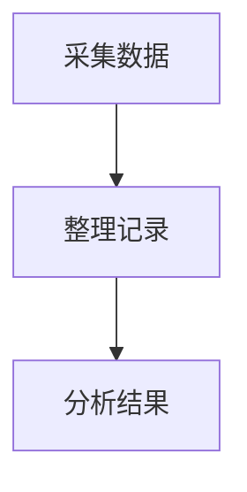

# Markdown 约定

本文档说明可稳定转换为 Word 的 Markdown 写法。

## 标题

```md
# 论文标题

## 引言

### 研究目标

#### 具体方法
```

- `#` 用作论文标题，不自动编号。
- `##`、`###`、`####` 分别作为正文中的一级、二级、三级标题。
- 不建议手写标题编号，转换工具会按模板设置自动编号。

## 摘要与关键词

```md
摘要：这里是摘要正文。

关键词：Markdown；DOCX；论文格式
```

也兼容将“摘要”单独成段、下一段写摘要正文。摘要标签、摘要正文、关键词标签和关键词内容都可以在模板中分别设置。

## Mermaid 图表与图题

````md


图 数据处理流程
````

图题紧跟 Mermaid 代码块。默认模板启用流程图、状态图、类图、时序图等常见图型，并以论文黑白风格输出 PNG；模板关闭某图型或图表渲染失败时，代码块将保留为文本。

## 表格与表题

表题放在表格正上方，且中间不要插入其他内容：

```md
表 实验参数

| 参数 | 数值 | 说明 |
| --- | --- | --- |
| A | 10 | 对照组 |
| B | 20 | 实验组 |
```

开启表题自动编号后，`表 实验参数` 会整理为类似 `表1-1 实验参数` 或 `表1 实验参数`。CAU 模板默认表格为无竖线三线表。

表格单元格内如需出现竖线，必须写作 `\|`，否则 GFM 会将其识别为新列。例如报文 `RDR1\|PING\|7\n` 应写成 `` `RDR1\|PING\|7\n` ``。

## 图片与图题

```md


图 系统总体结构图
```

图片单独成段，图题放在图片正下方。图片会以 Word 嵌入型图片居中插入，并限制在正文可用宽度内。

## 代码块

````md
```ts
export interface DocumentAsset {
  path: string;
  fileName: string;
}
```
````

普通代码块会渲染为居中的嵌入式容器，内容左对齐。代码字体、字号、宽度、段前和段后均可在模板中设置。
