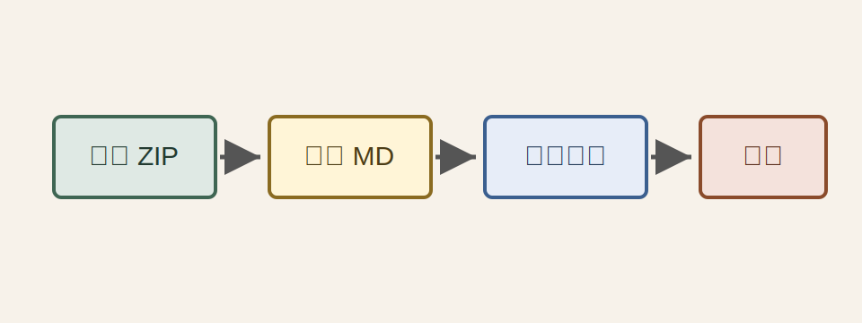
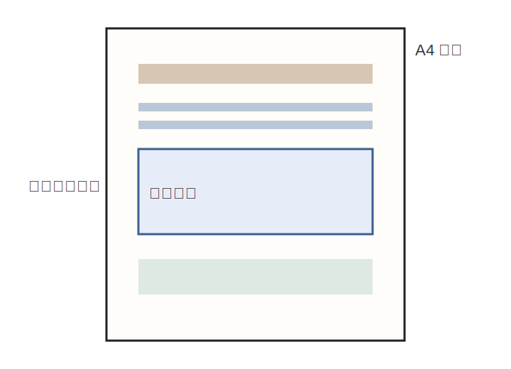
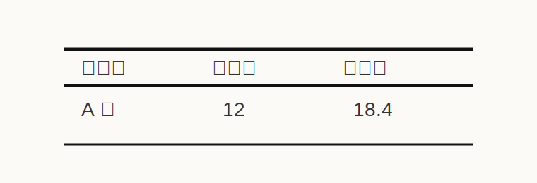

# 中国农业大学课程论文格式转换综合测试文档

## 摘要

本文档用于测试纯前端 Markdown 转 Word 工具的完整转换能力，重点覆盖图片相对路径、各级标题、三线表、正文段落、引用、列表与代码块。所有图片均放置在 `images/` 目录下，并通过相对路径引用。

关键词：Markdown；DOCX；三线表；图片规范化；CAU 模板

## 1 引言

农业工程类课程论文通常包含文字说明、数据表格、流程示意图、实验照片与结果图。为了保证导出的 Word 文档具备稳定格式，本样例故意混合多种 Markdown 结构，并在不同章节穿插图片。



### 1.1 测试目标

本测试文档关注以下能力：

- 标题层级能映射到 Word 标题样式；
- 正文段落使用 CAU 课程论文正文样式；
- 表格使用三线表；
- 图片从 zip 内 `images/` 目录读取；
- 图片在 Word 中使用“图片”段落样式；
- 缺失图片能够被明确提示。

### 1.2 约束条件

> 该工具第一版只生成 Word，不做实时预览、不做 PDF、不依赖服务端。所有文件解析和文档生成均应在浏览器本地完成。

## 2 材料与方法

### 2.1 zip 目录结构

推荐 zip 包内结构如下：

```text
report.md
images/
  flow.svg
  layout.svg
  table-context.svg
  result-chart.svg
  photo-placeholder.svg
  nested/detail.svg
```

实际课程论文中，图片文件名可以使用英文、数字和短横线，避免空格和特殊符号。



### 2.2 模板参数

| 项目 | CAU 课程论文默认值 | 自定义模板可修改 |
| --- | --- | --- |
| 纸张 | A4 | 是 |
| 页边距 | 上下 2.54 cm，左右 3.18 cm | 是 |
| 正文 | 宋体，小四，固定 20 磅 | 是 |
| 图片样式 | 图片，嵌入型，居中 | 是 |
| 表格样式 | 三线表 | 是 |

### 2.3 处理流程

1. 用户上传 zip 包；
2. 程序识别唯一 Markdown 文档；
3. 程序读取 `images/` 目录中的图片资源；
4. Markdown 被解析为中间文档模型；
5. 当前格式模板应用到文档模型；
6. 浏览器生成并下载 `.docx` 文件。

## 3 数据与结果

### 3.1 三线表测试

下表用于测试普通数据表：

| 处理组 | 样本数 | 平均值 | 标准差 | 备注 |
| --- | ---: | ---: | ---: | --- |
| A 组 | 12 | 18.4 | 1.2 | 对照 |
| B 组 | 12 | 21.7 | 1.5 | 改良处理 |
| C 组 | 12 | 20.1 | 1.1 | 复核处理 |



### 3.2 图片规范化测试

本节连续放置多张宽高比例不同的图片，用于检查图片是否按正文宽度限宽，并保持原始比例。


### 3.3 复杂表格测试

| 阶段 | 输入 | 输出 | 失败模式 |
| --- | --- | --- | --- |
| 解压 | zip 文件 | Markdown 与图片资源 | 多个 Markdown 文件 |
| 解析 | Markdown 文本 | DocumentModel | 非 GFM 表格 |
| 渲染 | DocumentModel + 模板 | DOCX 字节流 | 图片路径缺失 |
| 下载 | DOCX Blob | 本地文件 | 浏览器阻止下载 |

## 4 讨论

### 4.1 图片路径

文档中的图片均使用 `images/...` 相对路径。程序应以 Markdown 文档所在目录为基准，把 zip 中的 `images/` 文件映射为 `DocumentAsset.path`。

### 4.2 代码块

以下代码块用于确认代码内容不会破坏文档结构：

```ts
export interface DocumentAsset {
  path: string;
  fileName: string;
  mimeType: string;
  data: Uint8Array;
  widthPx?: number;
  heightPx?: number;
}
```

## 5 结论

该样例覆盖第一版工具的主要功能面。若导出的 Word 中图片全部正常显示、段落样式为“图片”、表格呈三线表、标题层级清晰，则说明 zip 输入逻辑与模板渲染主链路基本可用。

## 参考文献

[1] 中国农业大学课程论文格式要求示例。  
[2] Markdown Guide. Markdown Syntax Documentation.  
[3] Office Open XML 文档结构规范。
