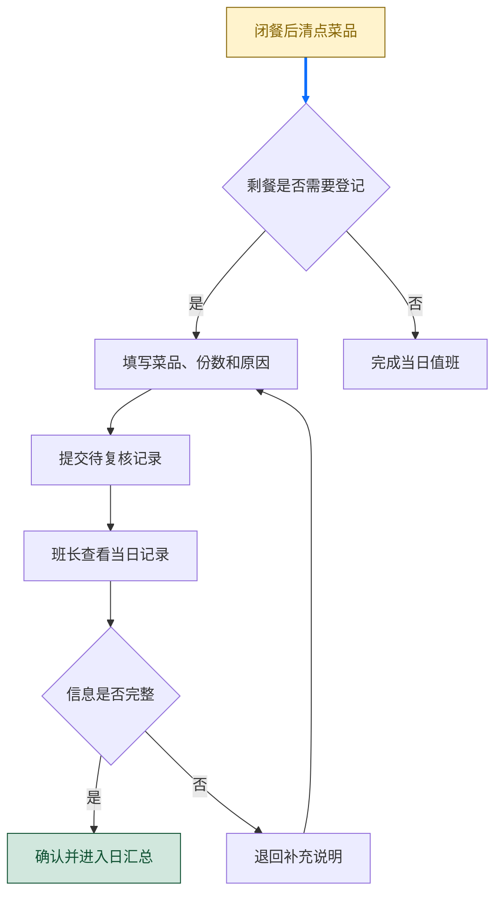
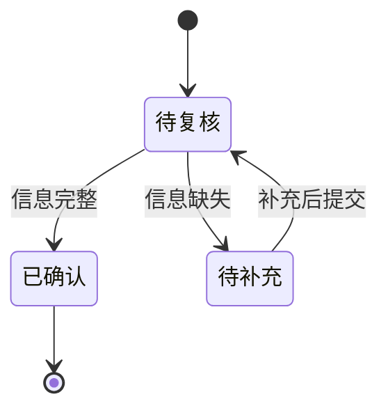
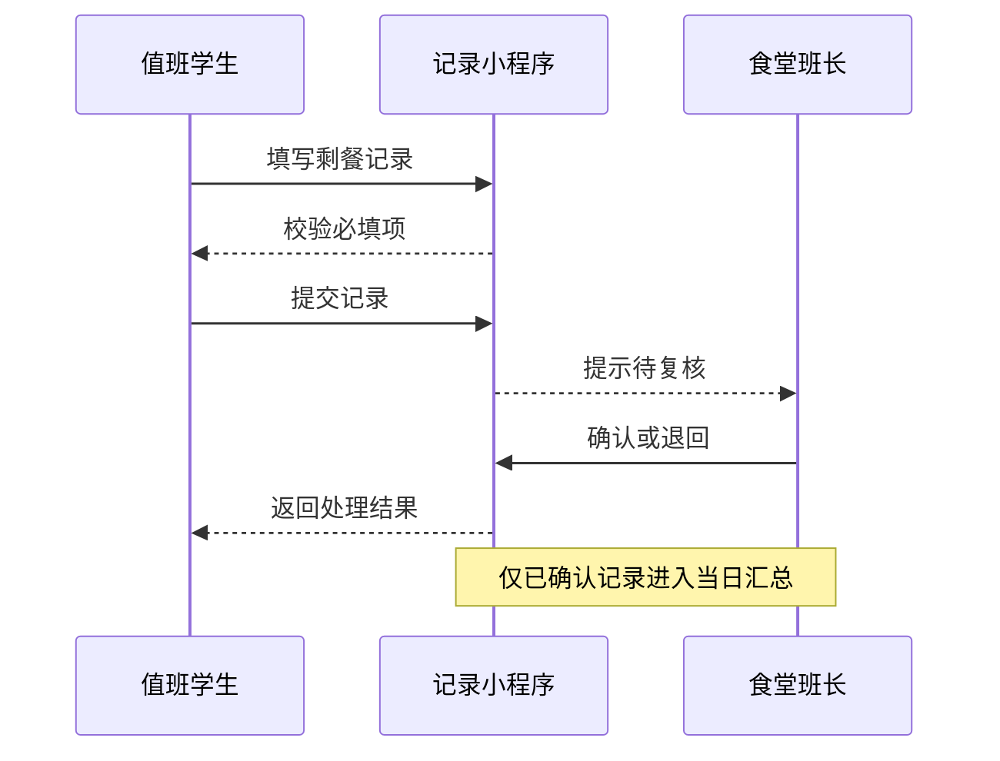
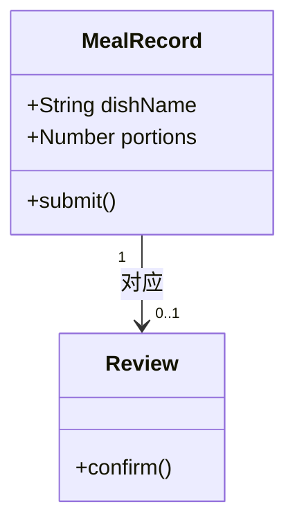

# 面向校园食堂剩餐记录的轻量化小程序设计与实践

摘要：为减少食堂闭餐后剩餐记录依赖纸质登记、汇总滞后的问题，本文以校内一处学生食堂为观察对象，设计了一个供值班学生使用的轻量化记录小程序。系统以“填写记录—班长复核—汇总查看”为主线，采用表单校验、状态流转和按日汇总三个简单模块完成数据管理。通过两周的试用记录，值班同学能够在闭餐后及时完成菜品数量、原因和处理方式的登记，班长也可以在当天查看异常记录。本文重点说明需求分析、核心流程和数据对象设计，并讨论试用过程中的不足。

关键词：食堂管理；剩餐记录；微信小程序；课程设计

## 研究背景与需求分析

本学期“软件工程基础”课程要求以校园中的小问题为对象完成一次小型系统设计。笔者在勤工助学值班时发现，闭餐后的剩餐情况通常记在纸质表格中，之后再由班长录入电子表。这个过程虽然不复杂，但容易遗漏菜品名称，也难以及时判断某一天是否出现异常波动。因此，本设计不追求复杂的预测功能，而是先把每天的记录流程整理清楚。

### 使用场景

系统的主要使用者是晚班值班学生和班长。值班学生在闭餐后录入剩餐信息；班长在当天或次日复核，并查看按菜品汇总的数量。为了避免把未确认的数据作为结论，记录在复核前只标记为“待复核”。

图 剩餐记录与复核流程

### 功能边界

系统仅保存菜品、份数、记录时间、原因说明和复核状态，不涉及支付、库存扣减或个人身份评价。这样做一方面符合课程设计的工作量，另一方面也避免因为数据来源有限而得出过度结论。

## 系统设计

### 记录状态设计

一条记录从创建到归档经历三个状态。退回后仍保留原始填写内容，便于值班学生根据意见补充，而不是重新填写整条记录。

图 剩餐记录状态转换

### 页面交互顺序

记录页面只保留必要字段。提交后，系统向班长端发出待复核提示；班长确认后，记录的状态才会进入日汇总。该顺序能保证值班学生看到自己的提交结果，也让班长的操作有明确边界。

图 剩餐记录提交时序

### 数据对象设计

课程设计阶段使用四个简单对象即可表达关系。`MealRecord` 保存一次登记的核心内容，`Review` 保存复核意见，`DailySummary` 用于按日查看，`DutyStudent` 表示提交人。对象之间的关系保持一对多，便于后续在数据库中转换为数据表。

图 剩餐记录核心对象关系

## 试用记录与讨论

本次试用选择连续十个晚餐时段，记录对象为米饭、两类荤菜和两类素菜。值班学生在实际闭餐后填写，每天由一名班长复核。由于样本量较小，表中的数量只用于说明记录方式，不作为食堂经营决策依据。

表 试用期间的记录完成情况

| 指标 | 数值 | 说明 |
| --- | ---: | --- |
| 试用天数 | 10 天 | 连续晚餐时段 |
| 提交记录 | 38 条 | 包含补充后再次提交 |
| 当日完成复核 | 35 条 | 其余次日完成 |
| 退回补充 | 6 条 | 主要缺少剩餐原因 |

从试用过程看，最容易遗漏的是“剩餐原因”字段。后续可以在页面中提供“备餐偏多”“口味反馈”“天气变化”等常用选项，同时保留文字补充。对于班长而言，按日汇总比翻看纸质登记表更直观，但仍应结合实际售卖量判断原因。

## 结论

本文围绕校园食堂的日常剩餐记录设计了一个轻量化小程序，并用流程图、状态图、时序图和类图描述了主要逻辑。试用表明，简单的状态复核可以减少信息缺失；不过系统尚未接入菜品售卖量，也未覆盖早餐和午餐场景。下一步可在征得食堂管理人员同意后，增加按菜品和时段的对比查看功能。

## 参考文献

[1] Pressman R S. 软件工程：实践者的研究方法[M]. 北京：机械工业出版社，2016.

[2] Sommerville I. 软件工程[M]. 北京：机械工业出版社，2019.
