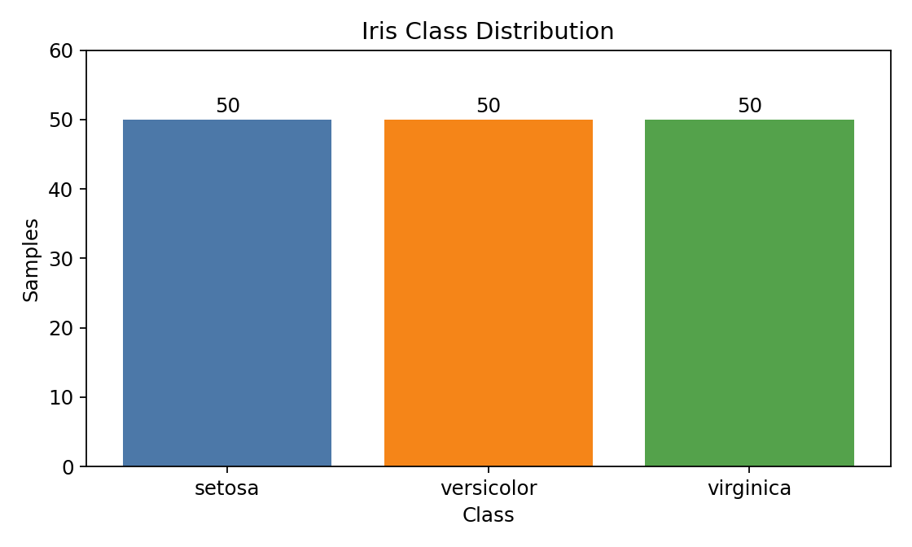
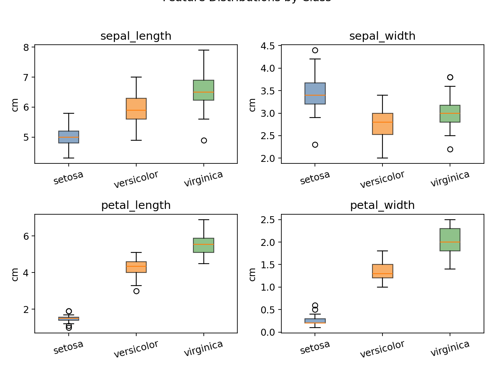
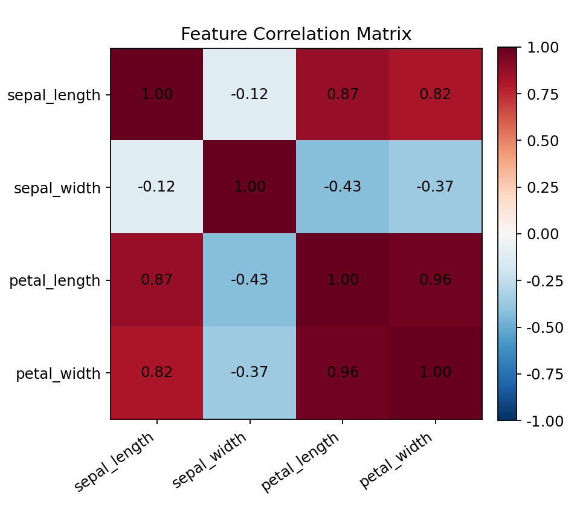
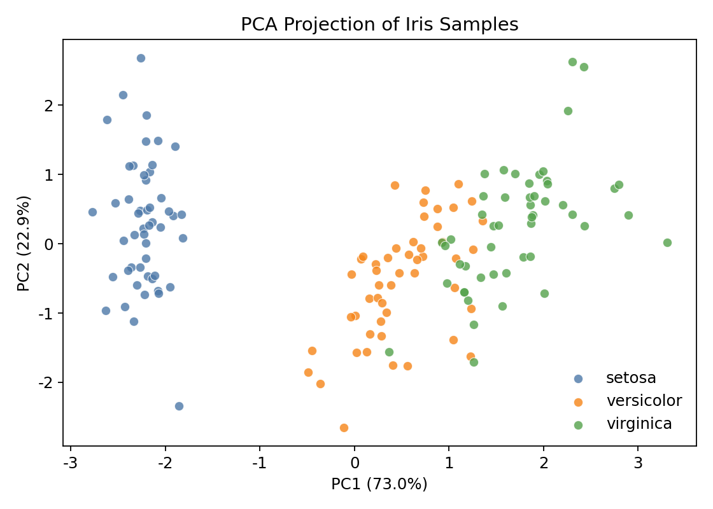
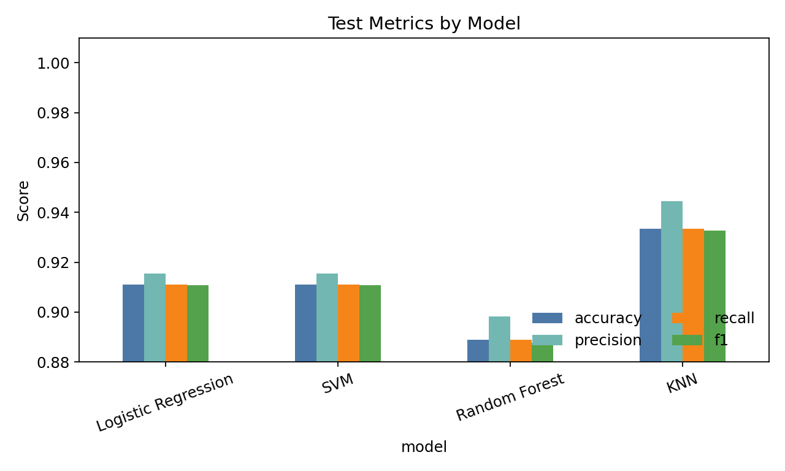
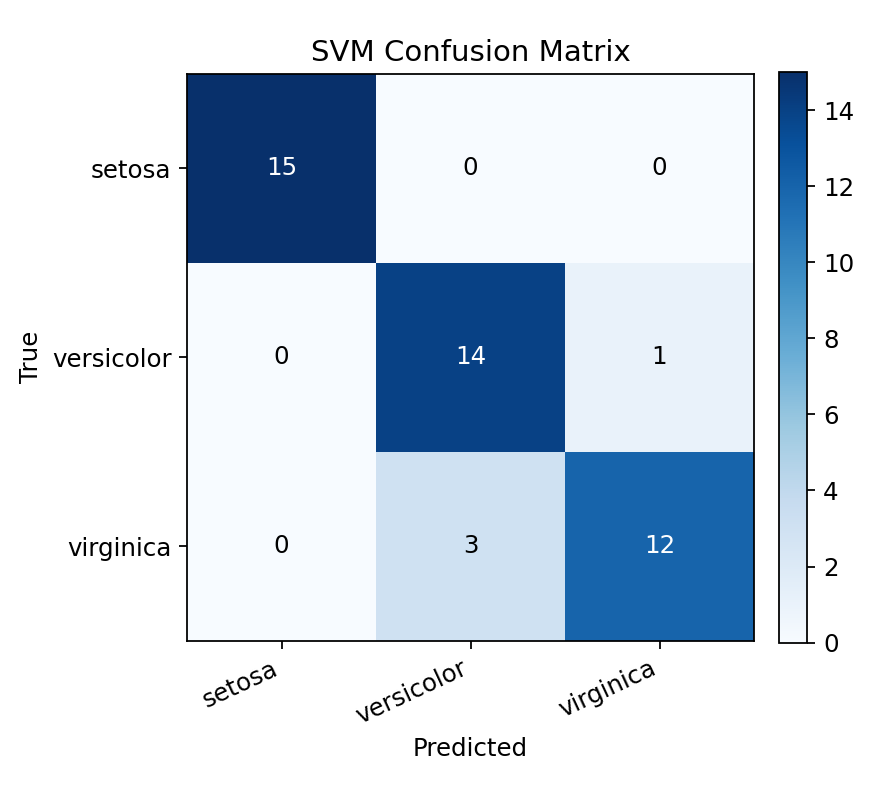
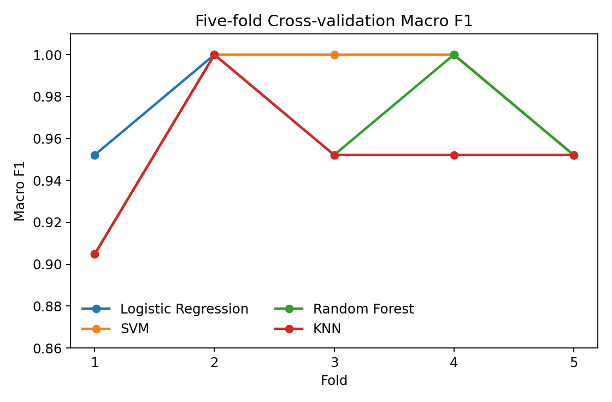
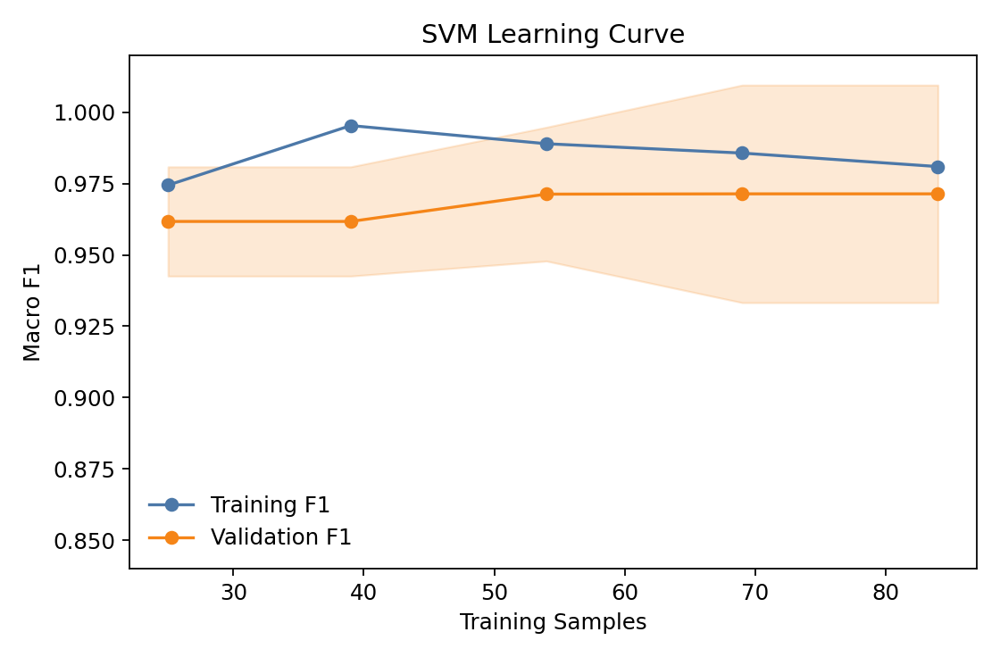

# 基于鸢尾花数据集的分类模型对比实验报告

摘要：本实验围绕一个小规模多分类任务，使用 scikit-learn 内置 Iris 鸢尾花数据集比较逻辑回归、支持向量机、随机森林和 K 近邻四类模型的分类效果。实验流程包括数据字段检查、训练集与测试集划分、特征标准化、模型训练、交叉验证和测试集评估。在固定随机种子 42、7:3 分层划分的设置下，K 近邻在测试集上取得最高的宏平均 F1 值 0.933，逻辑回归和支持向量机均为 0.911，随机森林为 0.888。该报告用于检验 Markdown 转 Word 工具对课程实验报告中标题、摘要、关键词、图片、表格、列表、引用和代码块等元素的整理能力。

关键词：机器学习；鸢尾花分类；模型评估；Markdown；实验报告

## 实验目的

本实验选取经典鸢尾花三分类任务作为验证对象，目标不是追求复杂算法，而是形成一份结构完整、数据图表充分、结论可复核的课程实验报告。具体目标如下：

- 理解监督学习分类任务的基本流程；
- 比较不同传统机器学习模型在同一数据集上的表现；
- 使用混淆矩阵、交叉验证和学习曲线分析模型稳定性；
- 形成包含多张图表、表格和代码片段的标准报告输入。

> 本报告使用 scikit-learn 1.8.0 内置的 Iris 数据集，实验指标和图表由本地脚本实际运行得到；数据不需要联网下载。

## 数据集与预处理

### 数据字段说明

实验数据包含 150 条样本，每条样本由 4 个连续型形态特征和 1 个类别标签组成。三个类别分别记为 setosa、versicolor 和 virginica，每类 50 条样本。实验采用分层抽样方式划分训练集和测试集，其中训练集 105 条、测试集 45 条。

表 数据集字段说明

| 字段名称 | 类型 | 单位 | 说明 |
| --- | --- | --- | --- |
| sepal_length | 连续型 | cm | 萼片长度 |
| sepal_width | 连续型 | cm | 萼片宽度 |
| petal_length | 连续型 | cm | 花瓣长度 |
| petal_width | 连续型 | cm | 花瓣宽度 |
| species | 分类型 | - | 鸢尾花类别标签 |



图 数据集类别分布柱状图

### 特征分布观察

从单变量分布看，setosa 在花瓣长度和花瓣宽度上与另外两类区分明显；versicolor 与 virginica 在萼片特征上存在较大重叠，需要模型综合利用多个特征进行判断。



图 四个形态特征箱线图



图 特征相关性热力图

### 预处理流程

本实验采用如下预处理步骤：

1. 检查缺失值和重复样本；
2. 按 7:3 比例进行分层训练测试划分；
3. 对连续特征使用训练集均值和标准差进行标准化；
4. 在训练集上进行五折交叉验证；
5. 在测试集上输出最终评价指标。

降维可视化用于观察样本在低维空间中的可分性。PCA 仅用于展示，不参与模型训练。



图 PCA 二维投影散点图

## 模型方法

### 候选模型

本实验选择四个常用分类模型。逻辑回归作为线性基线，支持向量机用于处理边界清晰但非完全线性的样本，随机森林用于观察树模型在小数据上的鲁棒性，K 近邻用于检验局部距离规则在该任务上的有效性。

表 训练参数表

| 模型 | 主要参数 | 预处理 | 选择理由 |
| --- | --- | --- | --- |
| Logistic Regression | max_iter=500, C=1.0 | 标准化 | 线性可解释基线 |
| SVM | kernel=rbf, C=3.0, gamma=scale | 标准化 | 适合中小规模非线性分类 |
| Random Forest | n_estimators=120, max_depth=4 | 无强制要求 | 可观察特征重要性 |
| KNN | n_neighbors=5, weights=distance | 标准化 | 反映局部样本距离关系 |

### 实验代码片段

以下代码片段展示核心训练逻辑，用于说明实验流程和测试代码块渲染效果。

```python
from sklearn.model_selection import train_test_split, cross_val_score
from sklearn.pipeline import Pipeline
from sklearn.preprocessing import StandardScaler
from sklearn.svm import SVC

X_train, X_test, y_train, y_test = train_test_split(
    X, y, test_size=0.3, stratify=y, random_state=42
)

model = Pipeline([
    ("scaler", StandardScaler()),
    ("clf", SVC(kernel="rbf", C=3.0, probability=True, random_state=42)),
])

cv_scores = cross_val_score(model, X_train, y_train, cv=5, scoring="f1_macro")
model.fit(X_train, y_train)
```

## 实验结果与分析

### 模型总体表现

四个模型在测试集上均能达到较好的分类效果。K 近邻的准确率和宏平均 F1 最高，达到 0.933；逻辑回归与支持向量机的测试集表现相同，宏平均 F1 均为 0.911；随机森林在本次划分下略低，宏平均 F1 为 0.888。由于数据规模较小，单次测试集结果可能受到划分影响，因此同时报告五折交叉验证结果。

表 模型性能汇总表

| 模型 | Accuracy | Macro Precision | Macro Recall | Macro F1 |
| --- | ---: | ---: | ---: | ---: |
| Logistic Regression | 0.911 | 0.916 | 0.911 | 0.911 |
| SVM | 0.911 | 0.916 | 0.911 | 0.911 |
| Random Forest | 0.889 | 0.898 | 0.889 | 0.888 |
| KNN | 0.933 | 0.944 | 0.933 | 0.933 |



图 模型评价指标对比柱状图

### 错分情况

从 SVM 的混淆矩阵看，setosa 类别没有错分，主要错误集中在 versicolor 与 virginica 之间。测试集中 15 个 versicolor 样本有 1 个被判为 virginica，15 个 virginica 样本有 3 个被判为 versicolor。这与特征分布观察一致：两类样本的萼片长度、萼片宽度和部分花瓣特征存在重叠。



图 SVM 测试集混淆矩阵

表 错分样本分析表

| 样本编号 | 真实类别 | 预测类别 | 主要原因 |
| --- | --- | --- | --- |
| T-003 | virginica | versicolor | 花瓣宽度为 1.5 cm，低于多数 virginica 样本 |
| T-031 | virginica | versicolor | 萼片宽度为 2.6 cm，花瓣宽度为 1.4 cm，接近 versicolor 区间 |
| T-040 | versicolor | virginica | 花瓣长度为 5.0 cm，位于两类交界区域 |
| T-043 | virginica | versicolor | 萼片长度为 4.9 cm，整体形态偏小 |

### 训练稳定性

五折交叉验证结果显示，逻辑回归的平均宏 F1 为 0.981，标准差为 0.023；SVM 的平均宏 F1 为 0.971，标准差为 0.038；K 近邻的平均宏 F1 为 0.952，标准差为 0.030；随机森林的平均宏 F1 为 0.962，标准差为 0.036。SVM 学习曲线显示，训练样本数从 25 增加到 84 时，验证集平均宏 F1 从 0.962 上升到 0.971，后期收益趋于平稳。



图 五折交叉验证得分图



图 学习曲线图

## 讨论

### 特征与模型的关系

花瓣长度和花瓣宽度是本任务中最有效的两个特征。线性模型能够识别大部分边界清晰的样本，但在 versicolor 与 virginica 的重叠区域仍有局限。本次测试集上 K 近邻表现最好，说明局部邻域关系对该划分较有效；交叉验证中逻辑回归平均分最高，说明简单线性边界在整体训练分布上也具有稳定表现。

### 实验局限

本实验数据规模较小，且类别分布均衡，因此单次测试集评价结果不适合直接推广到类别不平衡或噪声更高的数据集。后续可以加入重复随机划分、网格搜索和外部验证集，以进一步评估模型泛化能力。

## 结论

本实验完成了一个完整但规模较小的机器学习分类任务。在固定划分的测试集上，K 近邻取得最佳表现；在五折交叉验证中，逻辑回归平均分最高；SVM 的混淆矩阵清楚展示了 versicolor 与 virginica 的边界混淆。作为 Markdown 转 Word 的测试输入，本报告覆盖了标题层级、摘要关键词、连续正文、引用、列表、代码块、三线表、图题自动编号、表题自动编号和嵌套图片路径等主要场景。
